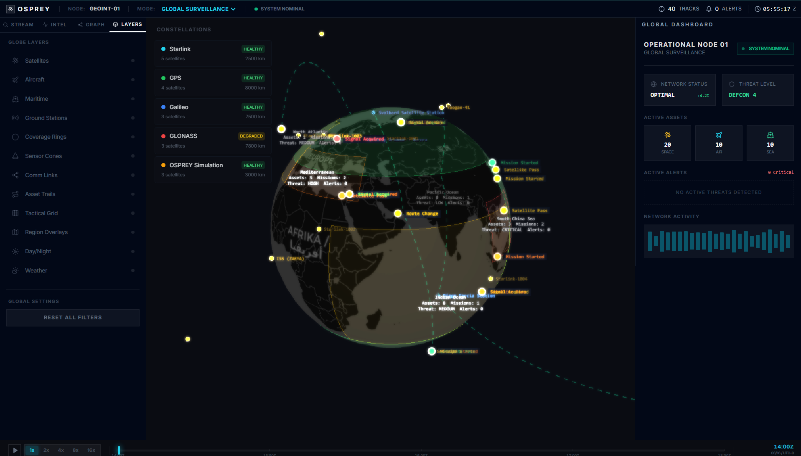
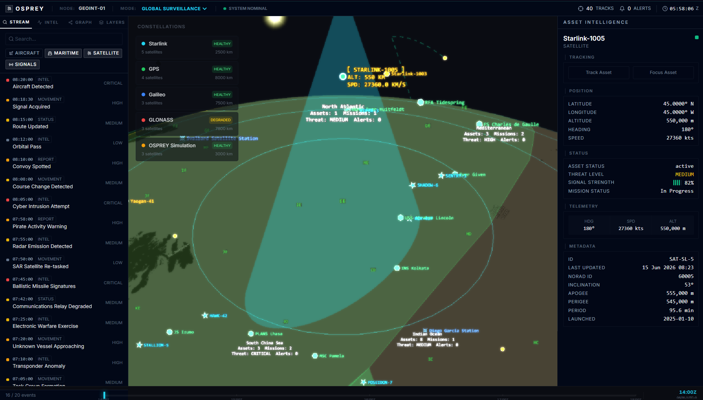
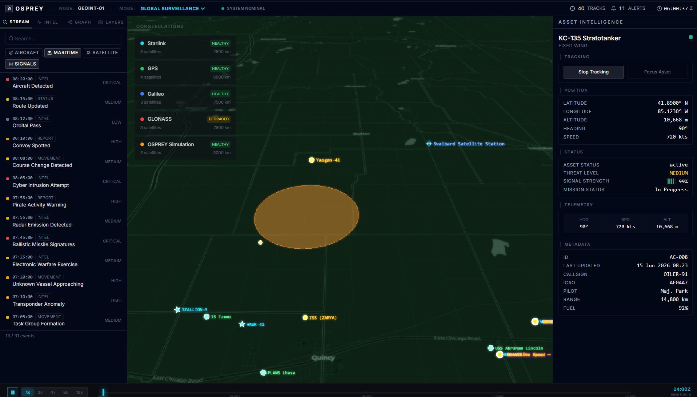

<div align="center">

```
 ██████╗ ███████╗██████╗ ██████╗ ███████╗██╗   ██╗
██╔═══██╗██╔════╝██╔══██╗██╔══██╗██╔════╝╚██╗ ██╔╝
██║   ██║███████╗██████╔╝██████╔╝█████╗   ╚████╔╝ 
██║   ██║╚════██║██╔═══╝ ██╔══██╗██╔══╝    ╚██╔╝  
╚██████╔╝███████║██║     ██║  ██║███████╗   ██║   
 ╚═════╝ ╚══════╝╚═╝     ╚═╝  ╚═╝╚══════╝   ╚═╝  
```

**Geospatial Intelligence Command Platform**

*Real-time 3D situational awareness across air, maritime, satellite, and ground domains*


-success?style=flat-square&labelColor=0a0800)


</div>

---

## MISSION BRIEF

OSPREY transforms raw geospatial data into a unified 3D operational environment. It tracks and visualizes global multi-domain activity — satellites, aircraft, maritime vessels, ground stations, and tactical infrastructure — through an event-driven intelligence engine paired with a CesiumJS globe.

Every pixel communicates operational meaning. Every data source is traced (live / cached / simulated / fallback). Every event derives from real system activity — TLE fetches, simulation ticks, sensor readings — never from fictional narratives.

---

## SCREENSHOTS

<div align="center">

<!-- PRIMARY — Full command interface overview -->


<br/>

<table>
<tr>
<td align="center" width="50%">



**Asset Detail Panel**

</td>
<td align="center" width="50%">



**Layer Controls + Timeline**

</td>
</tr>
</table>

</div>

---

## SYSTEM ARCHITECTURE

```
                         ┌─────────────────────────────────┐
                         │         OSPREY ENGINE            │
                         │  (src/engine/)                   │
                         │                                  │
  CelesTrak ───► CelesTrakProvider ──┐                      │
  OpenSky  ───► OpenSkyGateway   ───┤   ┌──────────────┐   │
  SimEngine ──► SimulationProvider ──┼──►│ EntityRepo   │   │
  AISStream ──► [planned]        ───┘   │ (unified     │   │
                                         │  store)      │   │
                              EventBus ◄─┤              │   │
                              ▲         │              │   │
                         ┌────┴────┐   └──────┬───────┘   │
                         │  Correlation        │           │
                         │  Engine             │           │
                         │  (4 rules)          │           │
                         └─────────┘           ▼           │
                                        Analytics Engine   │
                                   (speed/heading/anomaly) │
                         ┌─────────────────────────────────┘
                         │
                         ▼
                    ┌──────────┐     ┌──────────────────┐
                    │  Zustand │────►│  CesiumJS Globe   │
                    │  Stores  │     │  (resium layers)  │
                    └──────────┘     └──────────────────┘
                                           │
                                    ┌──────┴──────┐
                                    │ 8+ Cesium   │
                                    │  Layers     │
                                    │ (pre-created│
                                    │  entities)  │
                                    └─────────────┘
```

## ENGINE MODULES

```
src/engine/
├── core/
│   ├── types.ts          ─ EntityBase, EventType, DataProvider interface
│   ├── event-bus.ts      ─ Typed pub/sub with filtering by type/source/region
│   └── entity-repo.ts    ─ Unified in-memory store with spatial queries
├── providers/
│   ├── interface.ts      ─ ProviderRegistry + BaseProvider lifecycle
│   ├── celes-trak.ts     ─ TLE provider (4 groups, per-group status, fallback ISS)
│   └── simulation.ts     ─ Wraps legacy SimulationManager as DataProvider
├── normalization/
│   └── normalizers.ts    ─ TLE→Entity, AIS→Entity, ADS-B→Entity converters
├── spatial/
│   └── index.ts          ─ Great-circle, coverage, orbital math, signal latency
├── correlation/
│   └── index.ts          ─ 4 cross-domain rules (proximity, geofence, weather, coverage)
├── analytics/
│   └── index.ts          ─ Speed anomaly, heading change, contact gap, stationary detection
├── gateway/
│   └── index.ts          ─ BaseGateway + OpenSky live ADS-B gateway
└── index.ts              ─ createEngine(), setSimulationAssets(), destroyEngine()
```

---

## FEATURE SET

### 🌍 3D Globe Interface
CesiumJS globe powered by **resium**. Zoom-adaptive multi-layer overlays with click-to-select asset panels. Every Cesium entity pre-created and toggled via `show` — zero destroy+recreate cycles.

### 📡 Multi-Domain Tracking
- **Satellites** — TLE propagation via CelesTrak (stations, Starlink, GPS, Galileo). Coverage rings, sensor cones (unit- cone + modelMatrix scaling), ground track, trajectory & constellation layers
- **Aircraft** — Live-ready OpenSky ADS-B gateway; simulated fixed-wing + rotary-wing with color-coded markers (green/blue/amber)
- **Maritime** — AIS-ready architecture; vessels with heading-rotated markers
- **Ground Stations** — Configurable station mesh with communication link rendering
- **Geofences** — 10 strategic zones with concentric rings, radial spokes, cardinal markers, distance labels

### ⚡ Event-Driven Intelligence Pipeline

```
System Activity ──► AlertManager ──► FeedEvent + Alert
                              │
                              ▼
                   Engine Analytics ──► Correlation Events
                              │
                              ▼
                   Zustand Store ──► UI Feed Stream
```

All events derive from actual system conditions:
- Signal level drops
- Speed anomalies (vs sustained average)
- Heading changes >45°
- Contact gaps >60s
- Stationary vessel detection
- Orbital altitude/inclination changes
- TLE fetch status per group

### 🎯 Asset Intelligence Cards
Hover any tracked asset for immediate intelligence card: position, velocity, altitude, status, active network links, **data source info** (quality, confidence, last updated, refresh rate).

### 🕐 Timeline System
Scrubable playback with time scaling (1×–64×). Replay historical sequences or run simulated scenarios forward.

### 🛡️ Geofencing & Tactical Overlays
10 concentric zone rings per geofence (red/orange/yellow/green), radial spokes, cardinal markers (N/E/S/W), per-ring distance labels, geodesic circle computation using local ENU frame and WGS84 ellipsoid.

### 🔗 Communication Network Visualization
Pre-allocated link entities between ground stations and satellites. Animated data flow (dashed polylines with material). Zero-allocation CallbackProperty with module-level scratch objects.

---

## DATA TRANSPARENCY

Every tracked asset carries a `DataSourceInfo` record:

| Field | Purpose |
|---|---|
| `source` | Provider name (e.g. "CelesTrak", "OSPREY Simulation Engine") |
| `lastUpdated` | Timestamp of last position refresh |
| `refreshRate` | Expected interval between updates |
| `quality` | `live` / `cached` / `simulated` / `fallback` |
| `confidence` | 0–1 confidence score in reported position |

---

## PERFORMANCE ARCHITECTURE

| Technique | Location |
|---|---|
| Entity pre-creation (never add/remove) | All globe layers |
| Unit cone + modelMatrix scaling | SatelliteCoverageRings, SensorConeLayer |
| Module-level scratch Cartesian3 objects | CommunicationLayer, GlobeViewer tracking |
| Module-level Color constants (parsed once) | EventMarkerLayer |
| Canvas + ImageMaterialProperty reuse | HeatmapLayer |
| ConstantPositionProperty.setValue() | TrajectoryLayer |
| 8 pre-created trajectory entities | TrajectoryLayer |
| 60s TTL pruning on seenIds | EventMarkerLayer |
| FIFO cap at 200 entries | feedData, alerts in Zustand |

### Memory Targets

| Metric | Status | Target |
|---|---|---|
| Baseline footprint | ~200 MB | <400 MB |
| Max visible entities | 500+ | 500+ |
| Cesium entity reuse | ✅ Enforced | Active |
| React re-renders | Selective subscriptions | Minimized |

---

## DATA SOURCES

| Feed | Provider | Status | Quality |
|---|---|---|---|
| Satellite TLEs | CelesTrak | ✅ Active, 4 groups, 403-tolerant | `cached` |
| Aircraft positions | OpenSky Network | 🔧 Gateway implemented | `live` |
| Simulated assets | OSPREY Engine | ✅ Active (82 assets) | `simulated` |
| Maritime AIS | AISStream | 📋 Planned | — |
| Seismic events | USGS | 📋 Planned | — |
| Weather | OpenWeather | 📋 Planned | — |

---

## CODE QUALITY

- **TypeScript** — `strict: true`, zero `any` types, 0 build errors (~1998 modules)
- **Build** — `npm run build` passes with 0 warnings
- **Cesium API** — all entity properties verified against actual API surface (no ghost properties like `dashOffset`)
- **Event safety** — all `movement.position` and `scene.canvas` accesses guarded
- **Cleanup** — all intervals, resize observers, animation frames, event subscriptions cleared on unmount
- **Architecture docs** — ARCHITECTURE.md, DESIGN_DECISIONS.md, DATA_PIPELINE.md

---

## GETTING STARTED

```bash
# Clone
git clone https://github.com/Mevis-byte/osprey.git
cd osprey

# Install
npm install

# Develop
npm run dev

# Build
npm run build
```

No API keys required for development — all core features work with simulated data and the public CelesTrak API.

---

## DEVELOPMENT ROADMAP

### Phase 1 — Core ✅
- [x] CesiumJS globe engine with 8+ operational layers
- [x] Satellite visualization (TLE-based orbital propagation)
- [x] Aircraft + maritime + ground station tracking
- [x] Event-driven intelligence stream
- [x] Event bus + entity repository + provider framework
- [x] Multi-window sidebar UI (left panel, right panel, timeline)
- [x] Geofencing system with tactical overlays
- [x] Memory leak fixes (caps, TTL, pre-creation)
- [x] Data transparency (per-asset source/quality/confidence)
- [x] Architecture documentation

### Phase 2 — Live Data & Polish
- [ ] OpenSky live aircraft tracking (gateway implemented)
- [ ] CelesTrak real TLE propagation (provider implemented)
- [ ] USGS earthquake event stream
- [ ] Day/Night terminator system
- [ ] Atmospheric scattering effects
- [ ] Animated communication links

### Phase 3 — Intelligence Expansion
- [ ] Mission system framework
- [ ] Threat zone overlays
- [ ] Predictive trajectory modeling
- [ ] AI-assisted anomaly detection
- [ ] Maritime AISStream integration

---

## DESIGN PHILOSOPHY

**Situational awareness is the product.** Every UI element communicates operational state, not decoration.

**Layers, not clutter.** Data density through layered visualization under operator control — not by forcing everything into view at once.

**Render at the speed of operations.** Real-time constraints are first-class requirements. Zero-allocation-per-frame patterns in hot paths. Entity reuse over destroy+recreate.

**Data provenance is non-negotiable.** Every position is tagged with source, quality, confidence, and last-updated timestamp. No unlabeled data.

---

## INSPIRATION

OSPREY draws from the visual language and operational logic of:
- Modern GEOINT and ISR platforms
- Command-and-control simulation systems
- Aerospace and defense tracking dashboards
- Tactical situational awareness interfaces

---

## STATUS

```
◉ ACTIVE DEVELOPMENT   ▸  Alpha
  Core engine operational. 0 build errors.
  Live data integration and intelligence expansion in progress.
```

---

## LICENSE

MIT — build freely, extend openly.

---

<div align="center">

*Built by a CSE student exploring geospatial systems, real-time visualization, and AI-assisted development.*

**OSPREY** → evolving toward a full-scale, real-time, multi-domain intelligence platform.

</div>
